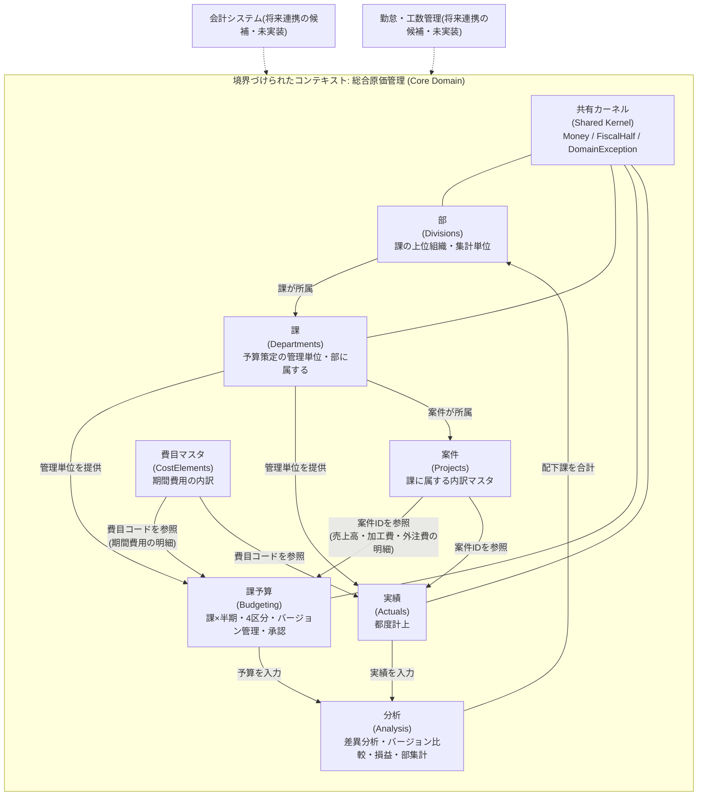
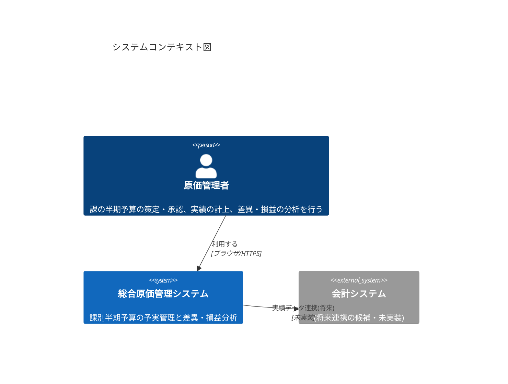
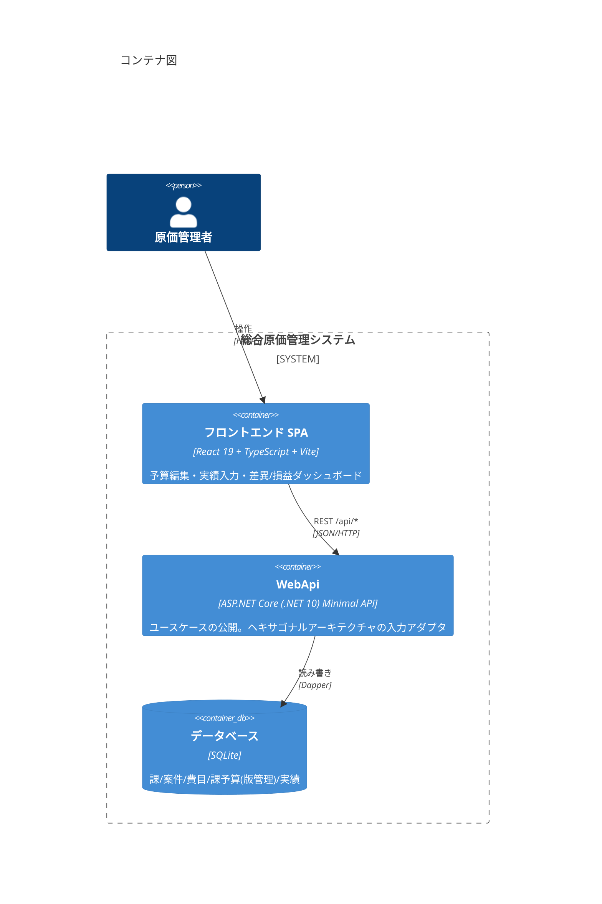
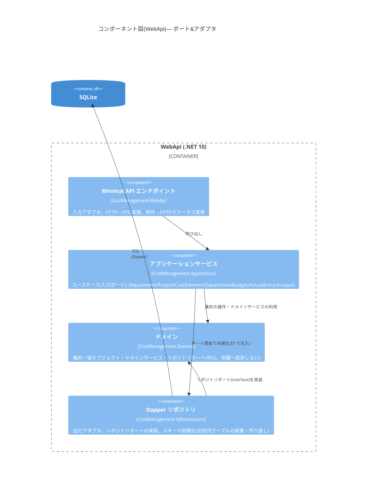
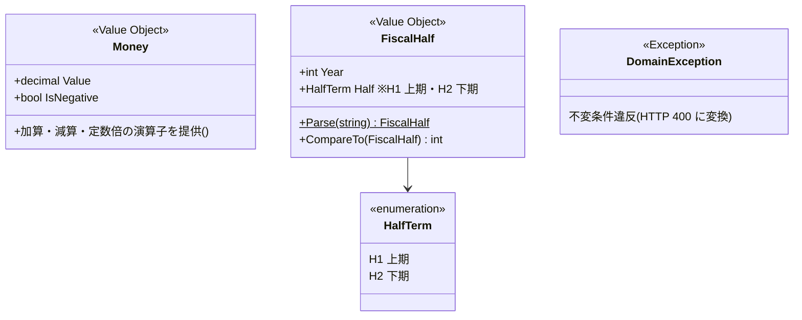
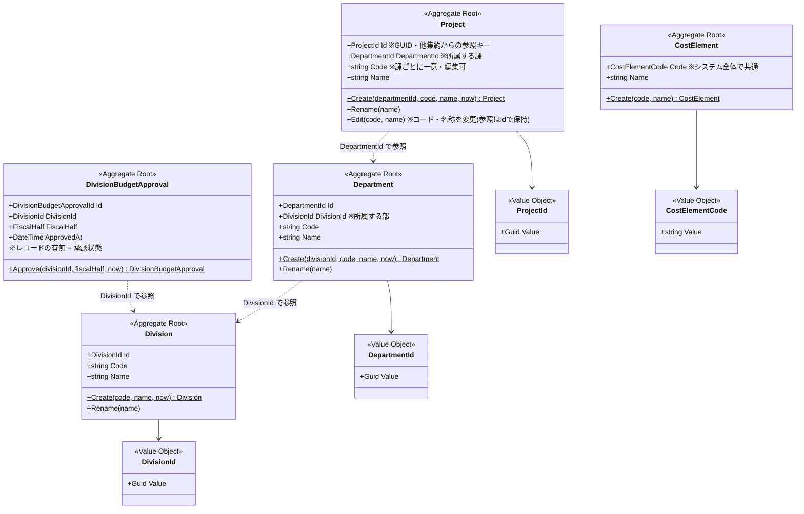
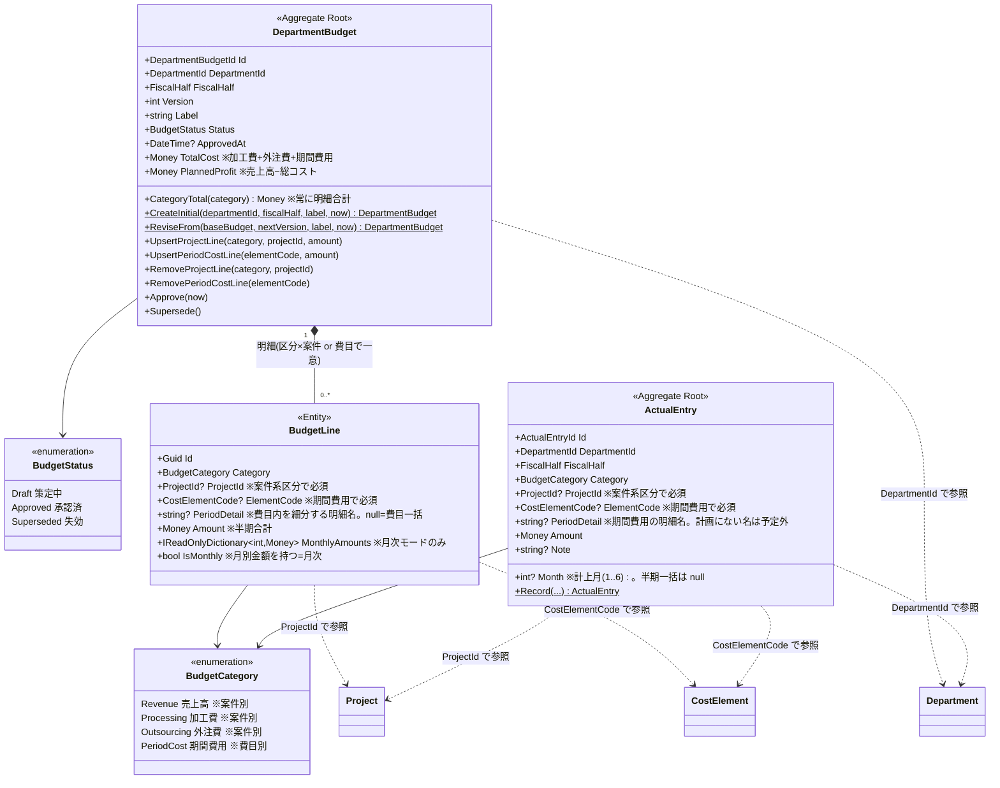
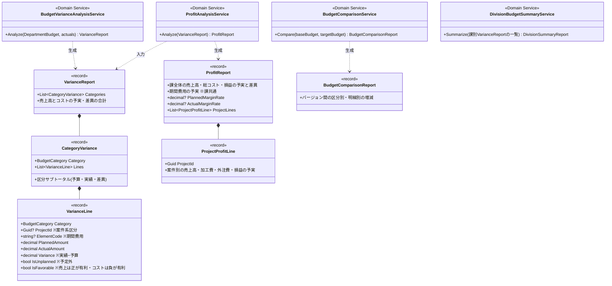

# 設計ドキュメント

総合原価管理システムのドメインモデル・ドメインサービス・アーキテクチャを図で示します。
図はすべて Mermaid で記述しており、GitHub 上でそのまま表示できます。

- [1. コンテキストマップ](#1-コンテキストマップ)
- [2. C4 モデル](#2-c4-モデル)
- [3. ドメインモデル クラス図](#3-ドメインモデル-クラス図)
- [4. ドメインサービス クラス図](#4-ドメインサービス-クラス図)

---

## 1. コンテキストマップ

本システムは単一の境界づけられたコンテキスト「**総合原価管理**」からなるモジュラーモノリスです。
コンテキスト内部は集約単位のモジュールに分かれ、共有カーネル(値オブジェクト)を介して連携します。

**設計上のポイント**

- 組織は**部(Division)> 課(Department)の2階層**。課は必ず1つの部に属します。
  部は予算を策定せず、配下課の予実を合計する集計ビュー(`DivisionBudgetSummaryService`)です
- 予算は**課 × 半期の単一集約**(DepartmentBudget)で、売上高・加工費・外注費・期間費用の
  4区分をまとめて1承認します(売上と原価を別集約で独立承認する方式は採っていません)
- 課の区分合計は**常に明細の合計として導出**します(ヘッダに金額を持たない=直接入力不可を
  構造的に保証)
- 案件・費目はマスタとして ID / コードで参照します(旧世代の「品目名の緩い結合」は廃止)。
  **案件(Project)は課に属し、案件コードは課ごとに一意**(別の課では同じコードを使える)。
  **費目(CostElement)はシステム全体で共通のマスタ**(課ごとの設定ではない)
- 分析(Analysis)は状態を持たず、予算・実績の集約を入力として受け取る
  **ドメインサービス群**として実現しています

## 2. C4 モデル

### Level 1: システムコンテキスト図

### Level 2: コンテナ図

### Level 3: コンポーネント図(WebApi コンテナ内・ヘキサゴナルアーキテクチャ)

依存の向きは常に内側(Domain)へ向かい、Domain は他のどの層にも依存しません。

## 3. ドメインモデル クラス図

### 3-1. 共有カーネル(値オブジェクト)

### 3-2. 課・案件・費目マスタ

### 3-3. 課予算・実績(中核の集約)

**不変条件(集約が強制するルール)**

| 集約 | 不変条件 |
|---|---|
| DepartmentBudget | 承認済み・失効済みは編集不可(編集は Draft のみ) |
| 〃 | 明細のない予算は承認不可 |
| 〃 | 明細キー(区分 × 案件/期間費用 × 費目)は集約内で一意(同一キーは上書き) |
| 〃 | 売上高・加工費・外注費の明細は案件必須(費目は指定不可)。期間費用の明細は費目必須(案件は指定不可) |
| 〃 | 期間費用は費目内を明細名でさらに細分できる(自由入力)。1費目内で「費目一括(明細名なし)」と「明細(明細名あり)」は併用不可(二重計上の防止) |
| 〃 | 改定版のバージョン番号は基となる版より大きい |
| 〃 | 金額は0以上 |
| 〃 | 区分合計はヘッダに持たず常に明細合計として導出(課レベルの直接入力は構造的に不可) |
| ActualEntry | 区分と案件/費目の排他は予算明細と同じ。金額は0以上。同一キーへの複数計上を許容(分析時に合算) |
| (Application 層) | ドラフトは同一(課, 半期)に1つまで。承認時に旧承認版を Supersede。案件は同一課所属のみ明細に使える |

### 3-4. リポジトリ(ポート)

実装は Infrastructure 層(Dapper + SQLite)。Domain 層にはインターフェースのみが属します。

```mermaid
classDiagram
    class IDivisionRepository {
        <<interface>>
        +FindByIdAsync(DivisionId) Division?
        +FindByCodeAsync(string) Division?
        +ListAsync() IReadOnlyList~Division~
        +AddAsync(Division)
        +UpdateAsync(Division)
    }
    class IDivisionBudgetApprovalRepository {
        <<interface>>
        +FindAsync(DivisionId, FiscalHalf) DivisionBudgetApproval?
        +AddAsync(DivisionBudgetApproval)
        +DeleteAsync(DivisionId, FiscalHalf)
    }
    class IDepartmentRepository {
        <<interface>>
        +FindByIdAsync(DepartmentId) Department?
        +FindByCodeAsync(string) Department?
        +ListByDivisionAsync(DivisionId) IReadOnlyList~Department~
        +AddAsync(Department)
        +UpdateAsync(Department)
    }
    class IProjectRepository {
        <<interface>>
        +FindByIdAsync(ProjectId) Project?
        +FindByCodeAsync(DepartmentId, string) Project?
        +ListByDepartmentAsync(DepartmentId) IReadOnlyList~Project~
        +AddAsync(Project)
        +UpdateAsync(Project)
    }
    class ICostElementRepository {
        <<interface>>
        +FindByCodeAsync(CostElementCode) CostElement?
        +ListAsync() IReadOnlyList~CostElement~
        +AddAsync(CostElement)
    }
    class IDepartmentBudgetRepository {
        <<interface>>
        +FindByIdAsync(DepartmentBudgetId) DepartmentBudget?
        +ListAsync(DepartmentId, FiscalHalf) IReadOnlyList~DepartmentBudget~
        +FindLatestApprovedAsync(DepartmentId, FiscalHalf) DepartmentBudget?
        +GetMaxVersionAsync(DepartmentId, FiscalHalf) int
        +AddAsync(DepartmentBudget)
        +UpdateAsync(DepartmentBudget)
    }
    class IActualEntryRepository {
        <<interface>>
        +FindByIdAsync(ActualEntryId) ActualEntry?
        +ListAsync(DepartmentId, FiscalHalf) IReadOnlyList~ActualEntry~
        +AddAsync(ActualEntry)
        +DeleteAsync(ActualEntryId)
    }
```

## 4. ドメインサービス クラス図

分析はすべて**状態を持たないドメインサービス**として実装し、集約(またはその分析結果)を
入力に取り、イミュータブルなレポート(record)を返します。

**分析の計算規則**

- 差異 = 実績金額 − 予算金額(符号付き)
  - コスト(加工費・外注費・期間費用): 正 = 予算超過 = **不利差異**(`IsAdverse`)
  - 売上高: 正 = 売上超過 = **有利差異**(`IsFavorable`)
- 突き合わせ粒度: (区分, 案件) または (期間費用, 費目, 明細名)。**分析・集計は半期粒度**
  (明細は月次入力もできるが半期合計に畳んで比較する。Issue #5)。
  同一キーの実績は合算。計画にない期間費用の明細名の実績は「予定外」(Issue #7)
- 損益:
  - 課全体 = 売上高 −(加工費 + 外注費 + 期間費用)。利益率 = 損益 ÷ 売上高(売上高0は null)
  - 案件別 = 売上高 − 加工費 − 外注費(期間費用は課共通のため配賦しない)
  - **案件別損益の合計 − 期間費用 = 課全体の損益**(整合性はテストで担保)
- 部集計(DivisionBudgetSummaryService): 配下課の VarianceReport を区分別・損益で合計する。
  承認済み予算のない課は合計から除外し未策定として課別内訳に表示する。「部合計 = 課別内訳の合計」。
  課別内訳(DepartmentSummaryLineDto)は課ごとの区分別内訳(Categories)も持ち、
  フロントの「予算(計画)」タブで課ごとの予算比較グリッド(粗利率つき)として表示する
- 部承認(DivisionBudgetApproval): (部, 半期) ごとの承認レコード。配下の全課が承認済み予算を
  持つときのみ承認可能(条件判定は Application 層)。取り消し可。課の承認フローとは独立で、
  部承認後に課が改定しても部承認は残る
