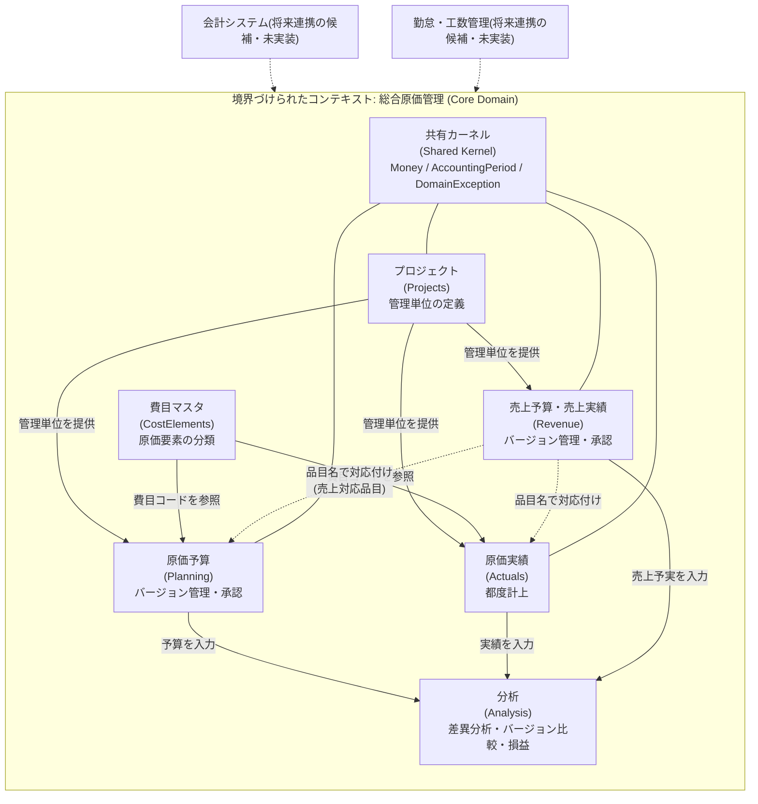
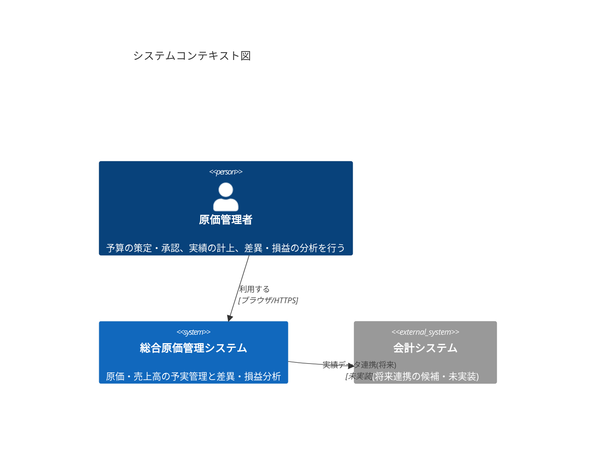
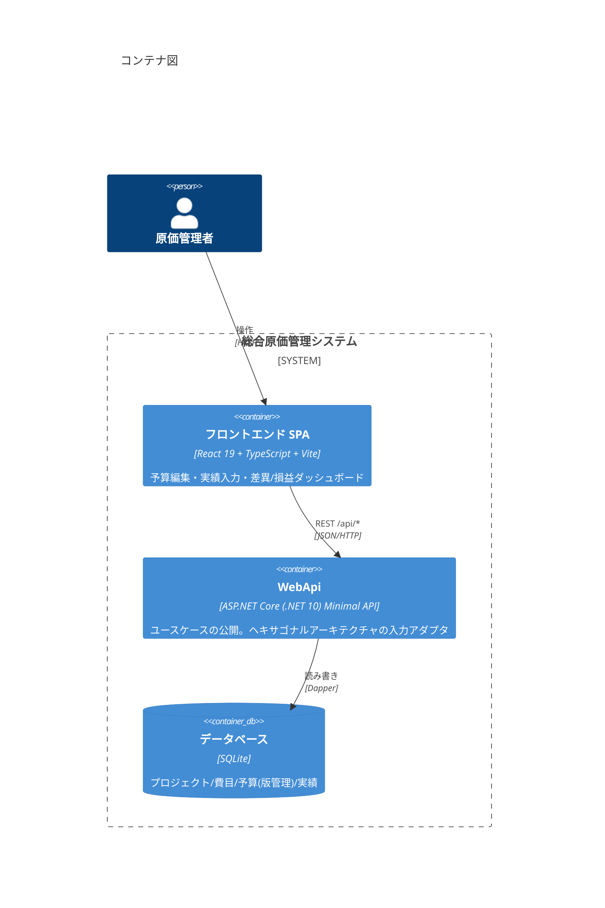
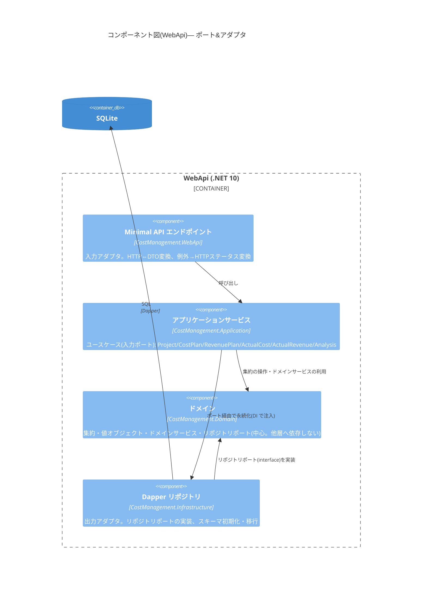
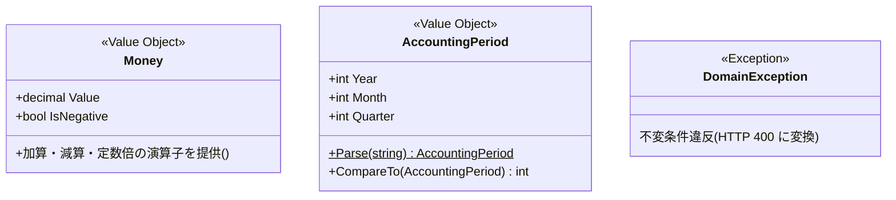
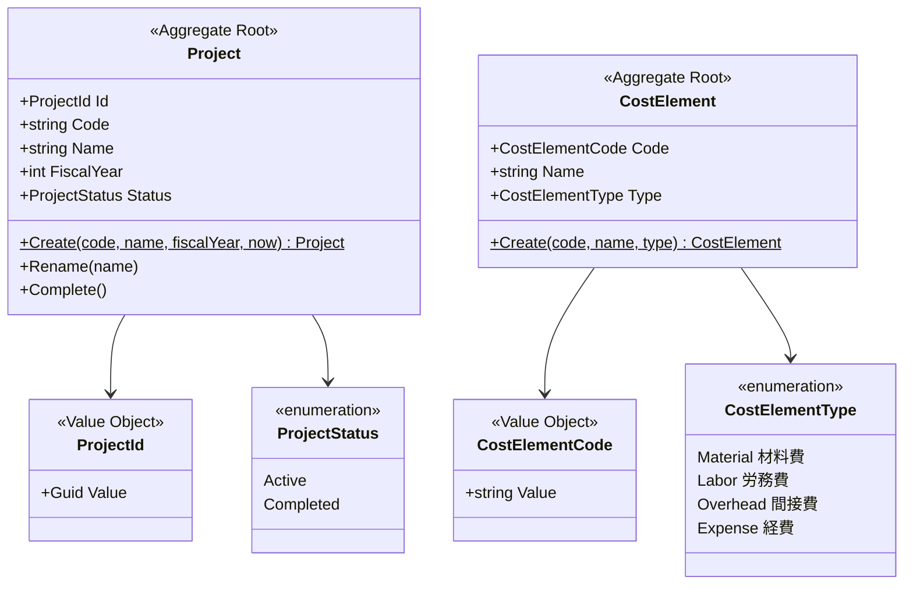
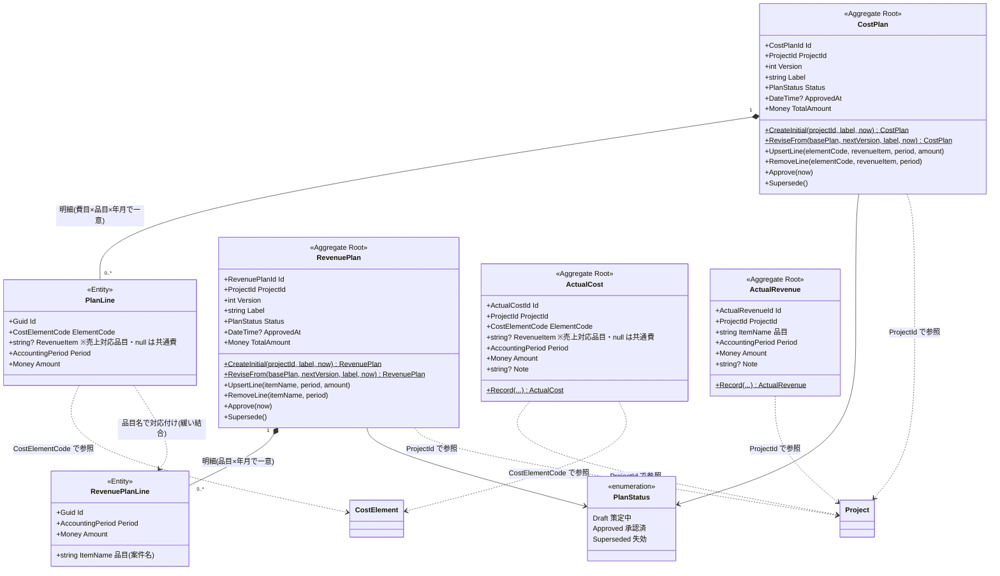
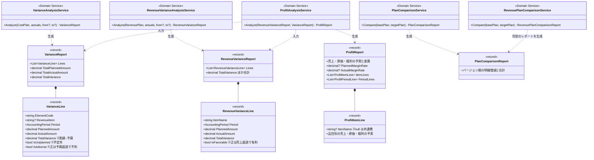

# 設計ドキュメント

総合原価管理システムのドメインモデル・ドメインサービス・アーキテクチャを図で示します。
図はすべて Mermaid で記述しており、GitHub 上でそのまま表示できます。

- [1. コンテキストマップ](#1-コンテキストマップ)
- [2. C4 モデル](#2-c4-モデル)
- [3. ドメインモデル クラス図](#3-ドメインモデル-クラス図)
- [4. ドメインサービス クラス図](#4-ドメインサービス-クラス図)

---

## 1. コンテキストマップ

本システムは単一の境界づけられたコンテキスト「**総合原価管理**」からなるモジュラーモノリスです。
コンテキスト内部は集約単位のモジュールに分かれ、共有カーネル(値オブジェクト)を介して連携します。

**設計上のポイント**

- 「売上」と「原価」は集約を分け、**品目名(文字列)による緩い対応付け**で結合しています。
  集約間を ID で強く参照しないことで、売上予算と原価予算を独立に改定できます
- 分析(Analysis)は状態を持たず、予算・実績の集約を入力として受け取る
  **ドメインサービス群**として実現しています(下流のコンフォーミスト的な位置づけ)

## 2. C4 モデル

### Level 1: システムコンテキスト図

### Level 2: コンテナ図

### Level 3: コンポーネント図(WebApi コンテナ内・ヘキサゴナルアーキテクチャ)

依存の向きは常に内側(Domain)へ向かい、Domain は他のどの層にも依存しません。

## 3. ドメインモデル クラス図

### 3-1. 共有カーネル(値オブジェクト)

### 3-2. プロジェクト・費目マスタ

### 3-3. 予算・実績(中核の集約)

**不変条件(集約が強制するルール)**

| 集約 | 不変条件 |
|---|---|
| CostPlan / RevenuePlan | 承認済み・失効済みは編集不可(編集は Draft のみ) |
| 〃 | 明細のない予算は承認不可 |
| 〃 | 明細キー(費目 × 売上対応品目 × 年月/品目 × 年月)は集約内で一意(同一キーは上書き) |
| 〃 | 改定版のバージョン番号は基となる版より大きい |
| 〃 | 金額は0以上 |
| ActualCost / ActualRevenue | 金額は0以上。同一キーへの複数計上を許容(分析時に合算) |

### 3-4. リポジトリ(ポート)

実装は Infrastructure 層(Dapper + SQLite)。Domain 層にはインターフェースのみが属します。

```mermaid
classDiagram
    class IProjectRepository {
        <<interface>>
        +FindByIdAsync(ProjectId) Project?
        +FindByCodeAsync(string) Project?
        +ListAsync() IReadOnlyList~Project~
        +AddAsync(Project)
        +UpdateAsync(Project)
    }
    class ICostElementRepository {
        <<interface>>
        +FindByCodeAsync(CostElementCode) CostElement?
        +ListAsync() IReadOnlyList~CostElement~
        +AddAsync(CostElement)
    }
    class ICostPlanRepository {
        <<interface>>
        +FindByIdAsync(CostPlanId) CostPlan?
        +ListByProjectAsync(ProjectId) IReadOnlyList~CostPlan~
        +FindLatestApprovedAsync(ProjectId) CostPlan?
        +GetMaxVersionAsync(ProjectId) int
        +AddAsync(CostPlan)
        +UpdateAsync(CostPlan)
    }
    class IRevenuePlanRepository {
        <<interface>>
        +FindByIdAsync(RevenuePlanId) RevenuePlan?
        +ListByProjectAsync(ProjectId) IReadOnlyList~RevenuePlan~
        +FindLatestApprovedAsync(ProjectId) RevenuePlan?
        +GetMaxVersionAsync(ProjectId) int
        +AddAsync(RevenuePlan)
        +UpdateAsync(RevenuePlan)
    }
    class IActualCostRepository {
        <<interface>>
        +FindByIdAsync(ActualCostId) ActualCost?
        +ListByProjectAsync(ProjectId) IReadOnlyList~ActualCost~
        +AddAsync(ActualCost)
        +DeleteAsync(ActualCostId)
    }
    class IActualRevenueRepository {
        <<interface>>
        +FindByIdAsync(ActualRevenueId) ActualRevenue?
        +ListByProjectAsync(ProjectId) IReadOnlyList~ActualRevenue~
        +AddAsync(ActualRevenue)
        +DeleteAsync(ActualRevenueId)
    }
```

## 4. ドメインサービス クラス図

分析はすべて**状態を持たないドメインサービス**として実装し、集約(またはその分析結果)を
入力に取り、イミュータブルなレポート(record)を返します。

**分析の計算規則**

- 差異 = 実績金額 − 予算金額(符号付き)
  - 原価: 正 = 予算超過 = **不利差異**(`IsAdverse`)
  - 売上: 正 = 売上超過 = **有利差異**(`IsFavorable`)
- 突き合わせ粒度: 原価 = (費目, 売上対応品目, 年月)、売上 = (品目, 年月)。同一キーの実績は合算
- 損益: 売上品目と原価の売上対応品目を突き合わせて品目別粗利を算出。
  対応品目のない原価は「共通費」行に集計され、**品目別の合計は常に全体の損益と一致**する
